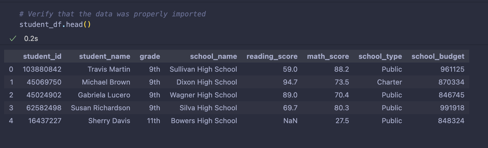
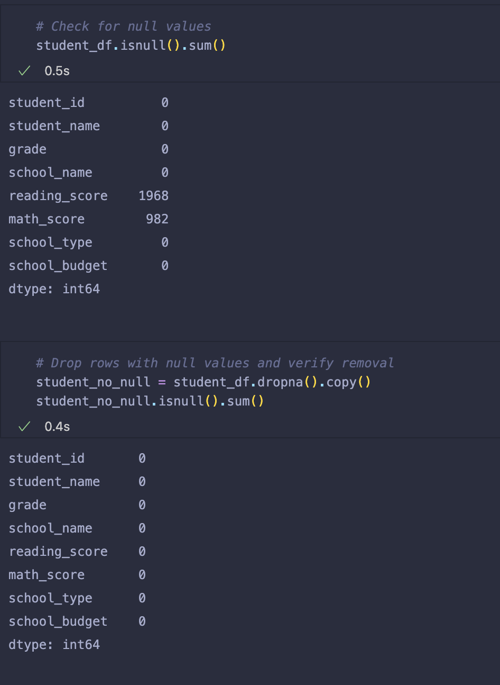
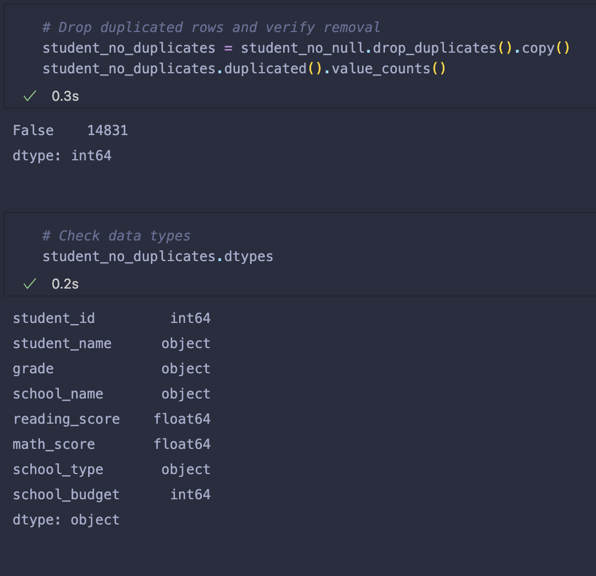
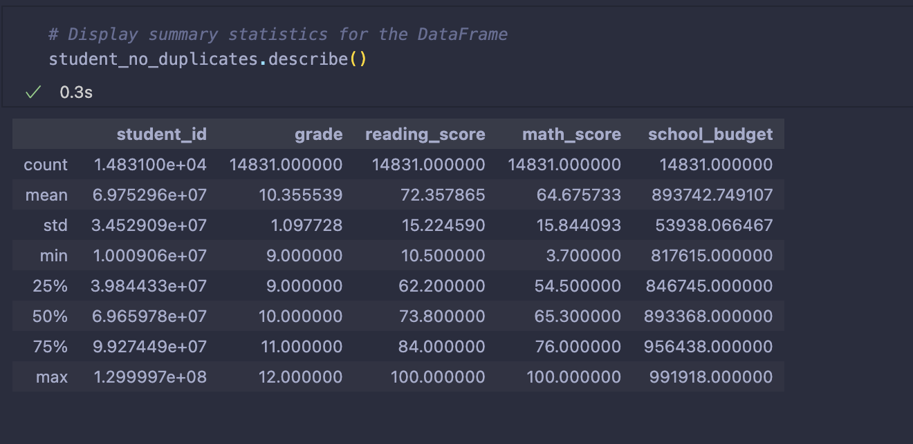
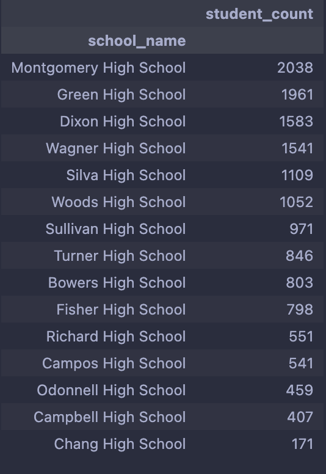
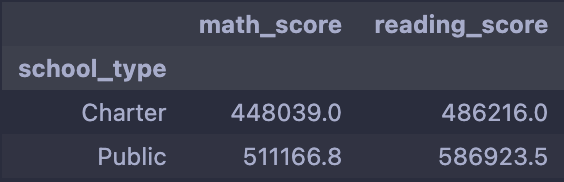
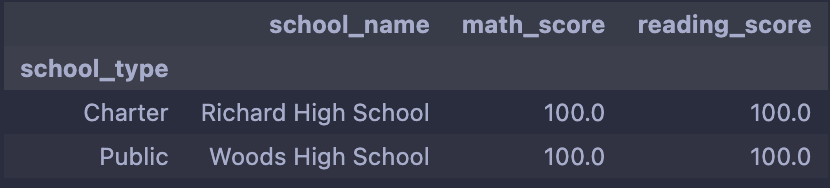
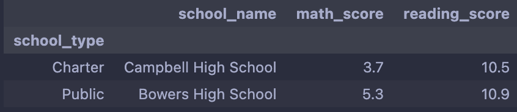
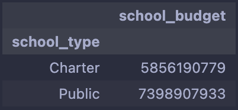
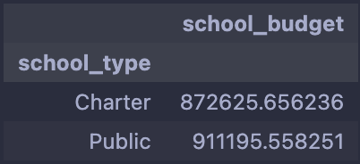

# School Analysis using Pandas
To chack the [code](https://github.com/hakeem235/school_analysis_pandas/blob/main/Student_Data_Challenge.ipynb)

## Purpose of the analyis

The purpose of this analysis is to use a new dataset containing school budgets and modify some of the analysis.
___________

## Cleaning the Dataset

### First check if the data imported properly

### Find and remove all null and NaN values

### Find and remove all uplicated rows

____

## Summarize the Data

____

## The Result 

- Montgomery High School has Montgomery the highest number of student. Total of 2038 student

- Public Shcools have the highest Scores in math and reading

- Richard High school have the highst scroe  between all charter school and Campbell High School have the less scroe

- Woods High School have the highst scroe  between all public school and Bowers High School have the less scroe

- The total budget for both charter school and public school is 13,255,098,712$.
- 5,856,190,779$ form charter school and 7,398,907,933$ for public school.

- The avareg budget for the public school is 911,195.558$ and for charter school is 872,625.656$.

